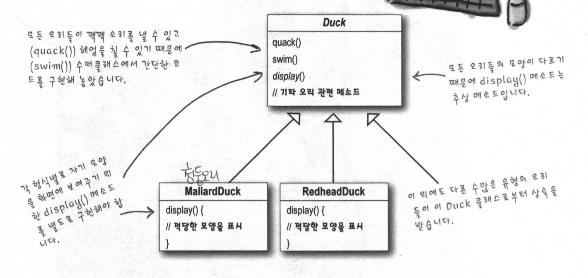
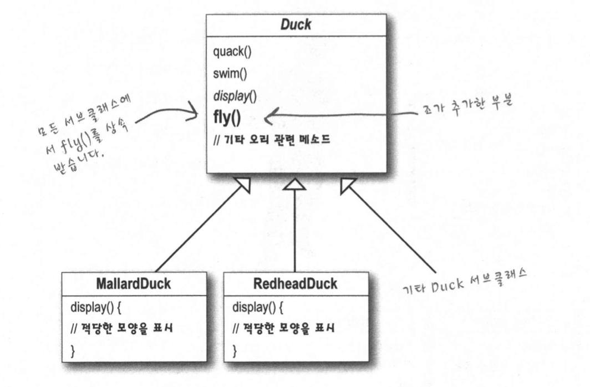
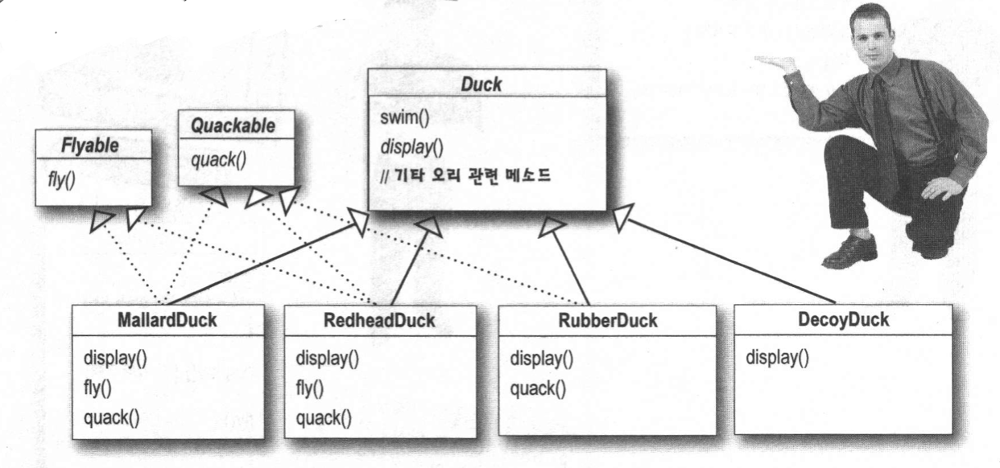
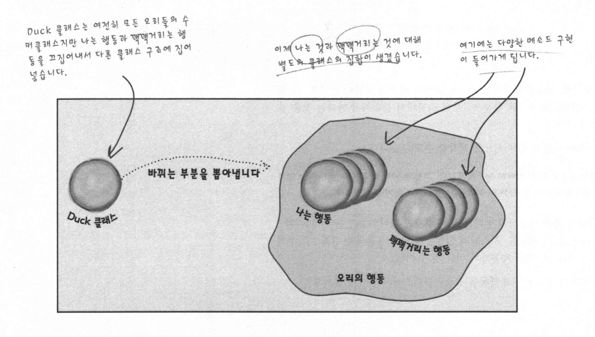
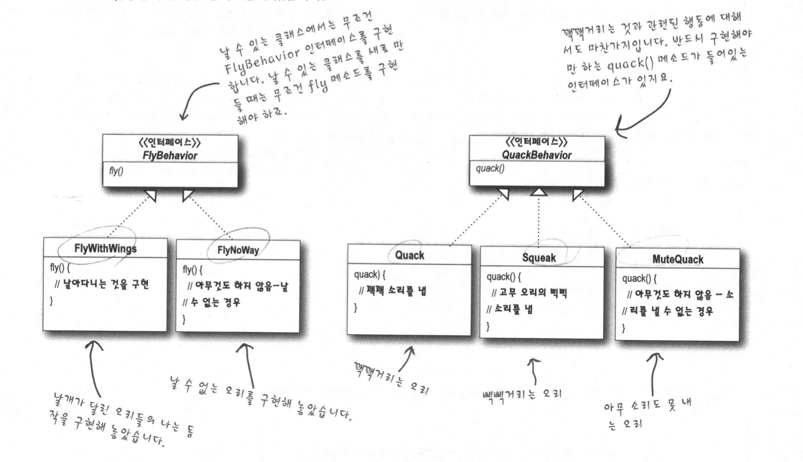
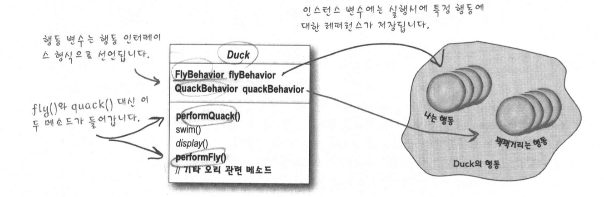
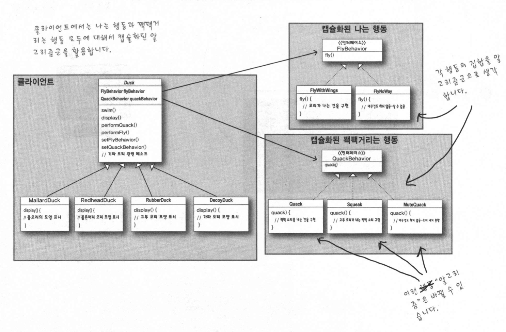

## Chapter 1. intro (Strategy Pattern)
> 기존 개발자들이 개발과정에서 발견한 문제점, 경험을 통해 발견한 개발 방법 (디자인) 활용법 및 장점에 대하여 알아보고, 이 과정에서 적용된 핵심적인 객체 지향 디자인 원칙을 알아보고 그 중 맛보기(?)로 Strategy Pattern의 적용법을 살펴본다.


#### Topic 1 . 오리 시뮬레이터 어플리케이션

> - 오리 시뮬레이터 개발
>
> - 조건
> - 1. 다양한 오리 종류
>   2. 오리마다 다양한 행동


##### 1.1 1차 구현

> 표준적인 객체 지향 기법을 활용하여 Duck 슈퍼 클래스 생성 후 , 슈퍼 클래스를 확장하여 다른 모든 종류의 오리 생성





=> Duck 슈퍼 클래스에 오리의 행동(짖기,수영....etc) 에 대한 메소드 구현 / 보여주는 방식은 각 하위 클래스마다 달라짐으로     display()는 추상 메소드 ( 하위 클래스에서 별도의 구현이 필요 !!)

=>Duck 슈퍼 클래스를 상속 받는 청둥오리 / 빨간머리 오리 ? 는 오리의 행동을 공통적으로 사용하고, 추상 메소드 display()에 대해서만 별도로 구현


##### 1.2 2차 구현(요구사항의 변경)

> 오리에 날기 기능 추가해달라는 요구사항이 발생 (구현의 변경이 필요!)



=> 기존 슈퍼 클래스에서 행동 fly()라는 메소드를 추가하여 하위 클래스에서 상속 받게 구현


**문제점 발생 !!**

=> 모든 서브 클래스가 fly()메소드 사용 가능 -> 기존 코드에 추가하여 주변 객체 까지 영향 받는 사이드 이펙트 발생!

​    **BUT** 그냥 상위 클래스의 메소드 `@Override` 해서 수정하면 작동 가능


**현재 코드의 문제점 !!**

1. 서브 클래스에서 코드가 중복된다. (매번 `@Override` 하면 중복 발생 가능성 높음 !)
2. 실행 시에 특징을 바꾸기 어렵다.
3. 모든 오리의 행동을 알기 힘들다. ( 각 서브 클래스 마다 구현하여서 !)
4. 코드를 변경했을 때 다른 오리들한테 원치 않은 영향을 끼칠 수 있다. ( 사이드 이펙트 )


##### 1.3  요구 사항의 주기적인 변경 발생 ( 6개월 )

> 6개월 마다 제품을 갱신하여 요구 사항이 바뀜에 기존의 방식으로 구현 시 빈번한 코드 변경이 발생 !
>
> 규격이 빠뀔 때 마다 각 하위 클래스의 오버라이드 메소드 fly(), quark() 를 살펴야 함.
>
> 모든 클래스가 공통적으로 가진 속성이 아니면, 상속을 사용하는 것은 올바른 방법이 x !(상황에따라)
>
> ex) 5만개의 서브 클래스 구현되어 있을 시 날아가는 모양 변경을 위해 5만개의 클래스 수정 필요 !
>
> 대안 => `Interface 구현`



 => fly()  기능과 Quack() 기능에 대해서 필요한 서브 클래스들은 해당 인터페이스를 구현해서 사용

**문제점 !**

=> 일부 문제는 해결가능 But 코드의 재사용성이 X =< 관리가 구리다.

=> 유지보수가 쉽고, 재사용성이 높으며, 수정 시 사이드 이펙트가 없는 방법이 필요 !!


**문제점 파악하기 **

처음 코드 구현은 슈퍼 클래스 변경 시 서브 클래스에서의 사이드 이펙트 발생 확률이 높다. 

두번째 Flyable, Quackable 인터페이스 사용 시 개별적으로 구현체를 만들어야 해서, 재사용성이 낮으며 한가지 행동 변경시 그 행동이 정의된 서브 클래스 전부 찾아서 수정하는 번거로움 및 버그 발생

=> 해결책 : **디자인 원칙 ! ** 어플리케이션에서 달라지는 부분을 찾아내고, 달라지지 않는 부분으로부터 분리 시킨다.

=> 코드에 새로운 요구사항이 있을 때마다 바뀌는 부분이 있다면, 그 행동을 바뀌지 않는 다른 부분으로부터 골라내서 분리가 필요(나머지 코드에 영향을 주지 않도록 캡슐화) 이를 통해 코드 변경과정에서 의도치 않은 버그를 줄이고 유연성을 높일 수 있다.


##### 1.4 바뀌는 부분과 안바뀌는 부분 분리하기

> 현재 fly() , Quark() 문제 ( 고무오리, 나무 조각 오리가 날고 짖는 문제)를 제외하고 Duck 슈퍼클래스는 OK !
>
> 변화 하는 부분과 변화하지 않는 부분을 두개의 집합(Set으로 분리)
>
> ex)
>
>  집합 1 . Duck 집합 (변하지 않는 행동은 유지하고 변하는 행동은 집합 2로 빼기)
>
>  집합 2. 오리 행동 집합 - 나는 행동 집합  -꽦꽦거리는 행동 집합 - ... (기타 오리 행동 집합)
>
> ( 다양한 행동 구현체들은 행동 집합 하위에 구현체를 생성 !)



**Question? 오리 행동 집합 디자인은 어떻게 할까? **

필요 조건

1. 오리 행동과 관련하여 최대한 유연함이 필요
2. 개별 Duck 객체 인스턴스에 행동 할당 가능
3. 행동을 동적으로 바꿀 `Setter Mehod` 구현

> 이러한 조건을 만족시키기 위한 디자인 원칙은 **구현이 아닌 인터페이스에 맞춰서 프로그래밍한다!**
>
> 각 오리의 행동은 인터페이스로 !(`FlyBehavior`, `QuackBehavior`) 표현하고 행동을 구현할 때 이런 인터페이스를 구현
>
> **So** Duck 클래스에서는 바뀌는 행동에 대한 구현을 고려할 필요가 x
>
> **Then ** 구체적인 오리 행동은 행동 인터페이스를 구현 / 슈퍼클래스, 서브클래스, 인터페이스 구현체 사이 유연성 보장

**결론 : ** 인터페이스에 맞춰서 프로그래밍하기 (상위 형식에 맞춰 프로그래밍 하기) 




=> 모든 변화하는 행동이 Duck 클래스 밖에 있고 재사용성이 좋아짐.

=> 행동 추가가 간편해짐


##### 1.5 리펙토링 하기

> 현재 바뀌는 행동에 대해서 인터페이스로 빼로 하위 구현체로 구현
>
> Duck에 인터페이스 형식의 인스턴스 변수 추가(날기 짖기)
>
> -> 인터페이스 형식 변수를 통해서 다양한 참조 가능



슈퍼 클래스 Duck

```java
public class Duck {
  //인터페이스 형식의 인터페이스 변수 2개 추가
  QuackBehavior quackBehavior;
  FlyBehavior flyBehavior;
	
  //각 인터페이스 구현체에 따른 다른 행위 출력
  // 역할을 위임
	public void performQuack(){
    quackBehavior.quack();
  }
  public void performFly(){
    flyBehavior.fly();
  }
}
```

하위 클래스 MallarDuck

```java
// Duck 하위 클래스 물오리
public class MallarDuck extends Duck {
  public MallardDuck(){
    // 생성자에서 인터페이스 변수에 대한 구현체 대입
    quackBehavior = new Quack();
    flyBehavior = new FlyWithWings();
  }
 	public void display(){
    System.out.println("저는 물오리입니다.");
  }
}
```


MallardDuck의 인스턴스가 생성될때 생성자에서 Duck으로 부터 상속받은 quackBehavior 인스턴스 변수에 Quack(인터페이스 구현 클래스) 형식의 새로운 인스턴스 대입 ( 날기도 동일)

Set은 Sample code 에서 ~


##### 1.6 전체 클래스 다이어그램



**정리 **

Duck 슈퍼 클래스는 공통은 메소드로 빼고, 바뀌는 부분은 인터페이스 변수로 대입하고, 이를 상속받은 하위 클래스(오리종류에 따른) 에서 캡슐화된 날기,짖기에 대한 인터페이스 구현체를 생성자에서 대입을 통해 다형성 보장


**디자인 원칙**

상속보다는 구성을 활용한다. => 유연성 크게 향샹, 다형성 보장, 공통 캡슐화


##### 1.7 오리 시뮬레이터에 적용한 디자인 패턴

**스트래티지 패턴(Strategy Pattern)**

> 알고리즘군을 정의하고 각각을 캡슐화하여 교환해서 사용할 수 있도록 만든다. 스트래티지를 활용하면 알고리즘을 사용하는 클라이언트와는 독립적으로 알고리즘 변경 가능.


 


