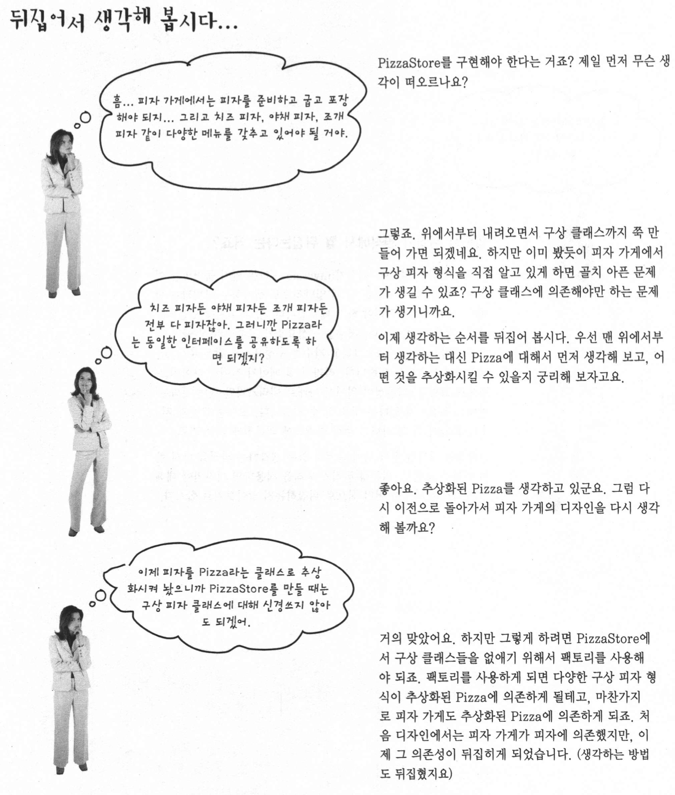

## Chapter 1. Factory Pattern
> 느슨한 결합을 위해 객체 생성 과정에서 캡슐화 및 추상화를 통하여 불필요한 의존성 제거가 목적


#### Q1. 객체 생성의 new 연산자?

> new 는 **"구상 객체"** 라서 구상 클래스 바탕으로 객체 생성 시 코드 수정이 빈번해지고, 유연성이 떨어진다.
>
> 주어진 조건에 따라서 구상객체 생성 시 변경 확장에 불리하고, 관리가 힘들고, 사이드 이펙트가 커짐.

인터페이스에 맞춘 코딩은 다형성을 통하여, 해당 인터페이스만 구현하면 어떤 구상 객체여도 사용 가능하여 변화에 대해 닫혀있고확장에 대해서 열린 코드 개발 가능. 이러한 개발을 위해서 바뀔 가능성이 있는 부분은바뀌지 않는 부분과 분리가 필요!


#### 1. 피자가게 예제(팩토리맛보기)

##### 1.1 디자인 패턴 도입전.

> 피자종류를 매개변수로 전달 받아 각 피자 종류에 따른 구상클래스를 인스턴스 변수에 대입 후 모든 피자가 동일하게 처리해야 할 부분을 처리

```java
Pizza orderPizza(){
  Pizza pizza = new Pizza();  // 구상 클래스 사용 ! 유연성 구리다
  
  pizza.prepare();
  pizza.bake();
  pizza.cut();
  pizza.box();
  return pizza;
}

// 피자 종류 고를 수 있게 수정
pizza orderPizza(String type){      // 매개 변수로 피자 종류를 전달
  Pizza pizza;
  
  if(type.equals("cheese")){        // 매개 변수에 따른 구상 클래스 인스턴스 생성하고 인스턴스 변수에 대입
    pizza = new CheezePizza();
  }else if(type.equals("greek")){
    pizza = new GreekPizza();
  }els if(type.equals("pepperoni")){
    pizza = new PepperoniPizza();
  }
  
  pizza.prepare();									// 기존과 동일하게 모든 피자 준비,굽기,자르기,포장
  pizza.bake();
  pizza.cut();
  pizza.box();
  return pizza;
}
```


##### 1.2 신규 피자 종류 추가 및 기존 피자 종류 삭제

> 기존 잘 안팔리는 그리스식 , 페페로니 피자 삭제 및 조개피자 야채피자 추가
>
> 피자 종류 선택하는 부분 : 자주 변경되는 코드
>
> 피자 준비,굽기,자르기,포장 : 변경이 거의 발생하지 않는 코드

```java
Pizza orderPizza(){
  Pizza pizza;
  
  if(type.equals("cheese")){
    pizza = new CheezePizza();
  }else if(type.equls("clam")){     //신규 추가 (메뉴 변경이 있을때 마다 if문을 수정)
    pizza = new ClamPizza();
  }else if(type.equls("veggie")){   //신규 추가 (자주 변경이 발생하는 부분)
    pizza = new VeggiePizza();
  }
  
  pizza.prepare();									// 거의 수정이 일어나지 않는 코드
  pizza.bake();
  pizza.cut();
  pizza.box();
  return pizza;
}
```


현재 코드의 가장 문제점은 인스턴스를 만들 구상클래스를 매개변수에 따른 if문을 통해서 선택하는 부분.

신메뉴 추가 및 기존 메뉴 삭제할때 마다 계속 변경이 발생.

=> 바뀌는 부분 바뀌지 않는 부분을 파악하였으니, 캡슐화 필요 !


##### 1.3 객체 생성 부분 캡슐화

> 계속하여 변경이 발생하는 피자 종류 고르는 로직을 별도의 객체로 처리
>
> 객체 생성(피자 종류에 따라 피자 객체 만들어줌)을 처리하는 클래스를 팩토리라고 부르며, 기존 orderPizza()  메소드는 팩토리의 클라이언트(팩토리를 호출)
>
> => 피자객체 만들려면 팩토리 객체를 호출하고 피자 달라고 요청 !
>
> => 팩토리를 통해서 orderPizza() 메소드는 더이상 어떤 피자를 만들어야 하는 지 알 필요가 x
>
> => orderPizza() 메소드는 pizza 인터페이스를 구현하는 피자를 전달 받아 공통로직만 호출.


```java
public class SimplePizzaFactory {			//팩토리의 역할은 클라이언트에게 피자 만들어 주기 !
  public Pizza createPizza(String type){  // 클라이언트에서 새로운 피자를 만들때 호출하는 메소드 
    Pizza pizza = null;
    
     if(type.equals("cheese")){      // 기존에 orderPizza()메소드에 있던 객체 생성로직
      pizza = new CheezePizza;
     }else if(type.equls("clam")){     
      pizza = new ClamPizza();
     }else if(type.equls("veggie")){   
      pizza = new VeggiePizza();
     }
     return pizza;
  }
}
```


##### 1.4 PizzaStore 클래스 수정

> 팩토리를 사용하여 기존 클라이언트(피자가게) 코드 수정

```java
public class PizzaStore {
  SimplePizzaFactory factory;						// 팩토리 선언
  
  public PizzaStore(SimplePizzaFactory factory){    // 생성자에서 팩토리 객체 전달하여 저장
    this.factory = factory;
  }
  
  public Pizza orderPizza(String type){
    Pizza pizza;
    pizza = factory.createPizza(type);							// 팩토리에 받은 피자 종류만 전달하여 객체 생성
    
    pizza.prepare();
    pizza.bake();
    pizza.cut();
    pizza.box();
    
    return pizza;
  }
}
```


##### 1.5 간단한 팩토리 정의

> 패턴이 아닌 관용구 , 팩토리 패턴 워밍업

- 간단한 팩토리 맛보기 다이어 그램


#### 2. 피자가게 예제(팩토리 메소드 패턴)

##### 2.1 pizzaStore 대박 때문에 프렌차이즈화

> 피자가게 대박 때문에 프렌차이즈화에 대한 요구사항 발생!
>
> **기존 코드는 그대로 사용하면서, 지역별로의 다른 차이점(피자스타일,지역특성)을 어떻게 수용할것인가?**

- 구현 요구사항 (각 지역 특색을 반영한 피자프렌차이즈)


=> 뉴욕은 뉴욕피자 / 시카고는 시카고식 피자가 필요하다!

=> 기존방식을 활용하여 SimplePizzaFactory -> [지역]pizzaFactory 로 변경하여 각 지역마다의 특징 수용


```java
NYPizzaFactory nyFactory = new NYPizzaFactory();	//뉴욕 스타일은 뉴욕 팩토리를 생성자 인자로 전달
PizzaStore nyStore = new PizzaStore(nyFactory);
nystore.order("Veggie");

ChicagoPizzaFactory ChicagoFactory = new ChicagoPizzaFactory();
PizzaStore ChicagoStore = new PizzaStore(ChicagoFactory);
Chicagostore.order("Veggie");
```


##### 2.2 각 지역별 팩토리 적용 문제점 발생

> 프렌차이즈에서 독자적인 방법을 사용하기 시작!
>
> 굽기,피자자르기,피자 포장 (기존에 store에 공통로직)
>
> **So** 피자 가게와 피자 제작 과정 전체를 하나로 묶어주는 프레임워크 개발 **But** 유연성은 잃어버리지 않으면서 !

기존 코드는 pizzaStore 하고 피자 생성 코드가 직접 연결되어 있었으나, 유연성이 없었다. 어떻게 변환...??

=> 피자를 만드는 모든 활동 자체는 전부 pizzaStore 클래스 안에서 처리하면서 각 지역을 살리기 위해 추상 메소드 사용

=> creatPizza() 메소드를 pizzaStore 클래스 안에 옮기고 추상 메소드 사용

```java
public abstract class PizzaStore {
  public Pizza orderPizza(String type){
    Pizza pizza;
    
    pizza = createPizza(type); // 팩토리 객체가 아닌 pizzaStore 클래스 내부의 createPizza 호출
    
    pizza.prepare();           // 기존과 동일
    pizza.bake();
    pizza.cut();
    pizza.box();
    
    return pizza;
  }
  
  abstract Pizza createPizza(String t
                             ype);	//팩토리 객체 대신 "팩토리 메소드"(추상메소드) 사용
}
```

=> 각 분점을 위한 서브클래스 생성 후 각 서브클래스에서 피자의 스타일을 결정 !

=> 모든 피자 준비 과정은 모든 분점에서 똑같이 이루어 져야하고, 분점은 피자 스타일만 달라져야해서 이렇게 달라지는 점을 createPizza() 메소드에 넣고 해당 메소드가 각 지역특성을 살린 피자 객체 생성 역할을 책임지고 pizzaStore 서브클래스는 이러한 createPizza() 메소드를 각각 구현


> 추상 클래스 피자 스토어는 각 서브클래스에서 createPizza() 메소드를 오버라이드 하여 반드시 구현하도록 강제함으로서 지역 별 피자 스타일도 살리고, 전체 과정을 각 분점에서 제어 못하도록 수정
>
> 해당 분점에서는 createPizza() 이외의 구현에 대한 관여x


* 분점 예제(뉴욕식 서브클래스)

``` java
public class NYPizzaStore extends PizzaStore {   // PizzaStore를 확장하여 orderPizza() 메소드 상속
  Pizza createPizza(String item){								 // 어느 객체를 만들지는 createPizza 메소드가 결정 
    if(item.equals("cheese")){									 // 추상메소드이기 때문에 반드시 서브클래스에서 구현 필요
      return new NYStyleCheesePizza();
    }else if(item.equals("veggie")){
      return new NYStyleVeggiePizza();
    }else{
      ...
    }
  }
}
```


`Factory Method` 는 객체 생성을 처리하며, 팩토리 메소드를 이용하면 객체를 생성하는 작업을 서브클래스에서 캡슐화 시킬 수 있고, 이를 통해 수퍼클래스에 있는 클라이언트 코드와 서브클래스에 있는 객체 생성 코드 분리 가능.

`abstract Product factoryMethd(String type)`

 abstract : 추상메소드로 선언하여 서브클래스에서 객체 생성을 위임

Product : 팩토리 메소드에서 생성하는 특정 제품군을 리턴, 해당 객체는 일반적으로 수퍼클래스의 정의된 메소드에서 사용

factoryMethod : 클라이언트에서 실제로 생성되는 구상 객체가 무엇인지 알수 없게 만드는 역할

String type : 팩토리 메소드를 만뜰때 매개변수를 써서 만들 객체의 종류를 선택가능 


##### 2.3 실제 동작 순서

```java
PizzaStore nyStore = new NYPizzaStore();
Pizza pizza = nyStore.orderPizza("cheese");
```


##### 2.4 피자 객체 예제

* 추상피자객체

> 추상 클래스로 생성하여 구현 객체는 피자객체를 확장하여 사용 

```java
public abstract class Pizza {
  String name;
  String dough;
  String sauce;
  ArrayList toppings = new ArrayList();
  
  void prepare() {
    System.out.prntln("피자 만들 준비");
  }
  void bake(){
    System.out.println("굽기");
  }
  void cut(){
    System.out.println("자르기");
  }
  void box(){
    System.out.println("포장하기");
  }
  
  public String getName(){
    return name;
  }
}
```


* 지역별 확장한 객체

>예제로 뉴욕식

````java
public class NYStyleCheesePizza extends Pizza {
  public NYStyleCheesePizza(){
    name = "뉴욕식 치즈 피자";
    dough = "뉴욕식 얇은 도우";
    sauce = "뉴욕식 마리나라 소스"
      
    toppings.add("Grated Reggiano Cheese");
  }
}
````


##### 2.5 팩토리 메소드 패턴


##### 2.6 병렬 클래스 계층 구조


##### 2.7 팩토리 메소드 패턴 정의


#### 3. 의존성 뒤집기 원칙

##### 3.1 기존 코드(처음 코드) 객체 의존성 

> PizzaStore 가 객체 생성을 팩토리에 만들지 않고 PizzaStore 클래스 내에서 직접 만들어 모든 객체에 직접적으로 의존하는 형태
>
> 의존하는 객체의 변경 시 PizzaStore 변경 발생할 여지가 있다.


##### 3.2 의존성 뒤집기 원칙 (Dependency Inversion Principle)

> **추상화된 것에 의존하도록 만들기 , 구상클래스에 의존하지 않도록 만들어야한다. **
>
>  특정 구현이 아닌 인터페이스 맞춰서 프로그래밍과 비슷하지만 추상화를 강조
>
> 고수준 구성요소가 저수준 구성요소에 의존하면 안된다.

"고수준 구성요소" : 다른 저수준 구성요소에 의해 정의되는 행동이 들어있는 구성요소

Ex) pizzaStore의 행동은 피자에 의해 정의되기에 pizzaStore는 고수준 구성요소 

​      피자 객체는 pizzaStore에서 사용되는 저수준 구성요소


기존 코드는 구체적인 구상 클래스에 의존 -> x

 원칙에 따라 구체적인 구상클래스가 아닌 추상 클래스, 인터페이스 같은 추상적인 코드에 의존하도록 개발

> PizzaStore 는 pizza 클래스에만 의존하게 되고 구체적인 구상 클래스도 pizza에만 의존하는형태


> 이러한 의존성 뒤집기 과정 (역순으로 밑에서 부터 설계해나간다)



> 가이드 라인
>
> 1. 어떤 변수에도 구상클래스에 대한 레퍼런스를 저장하지 않는다.
> 2. 구상 클래스에서 유도된 클래스를 만들지 않기
> 3. 베이스 클래스에 이미 구현되어 있던 메소드를 오버라이드 하지 않기


#### 4. 추상 팩토리

##### 4.1  각 지역별 싸구려 재료 사용하여 마진 올리기!

> 각 지역별 싼 재료를 사용하여 마진을 올리는 문제가 발생하여, 분점이 좋은 재료를 사용하도록 구조 변경이 필요한 요구사항 발생!
>
> => 각 분점별 원재료군을 처리할 방법이 필요하다  By 원재료 팩토리를 통해서


 

##### 4.2 원재료 공장 만들기

> 원재료를 생산하는 팩토리 인터페이스

```java
public interface PizzaIngredientFactory {	//인터페이스에 각 재료별 생성 메소드를 정의
		public Dough createDough();
  	public Sauce createSauce();
  	public Cheese createCheese();
  	public Veggies[] createVeggies();
  	public Pepperoni createPepperoni();
  	public Clams createClam();
}
```

1. 지역별 팩토리를 만들어 각 생성 메소드를 구현하는 PizzaIngredientFactory 클래스를 만들어야한다.
2. 팩토리에서 사용할 치즈.소스 등 의 원재료 클래스 구현
3. 원재료 공장을 pizzaStore에서 사용하여 모든걸 하나로 묶기


> ex ) 뉴욕 원재료 공장 소스
>
> 공장에 따라 원재료의 구현체만 달라진다.

```java
public class NYPizzaIngredientFactory implements PizzaIngredientFactory {
  // 모든 원재료 공장 구현해야하는 인터페이스를 구현
  public Dough createDough(){           //재료구
    return new ThinkCrustDough();
  }
  public Cheese createSauce(){
    return new MarinaraSauce();
  }
  public Pepperoni createPepperoni(){
    return new SlicePepperoni();
  }
  .
  .
  .
}
```


##### 4.3 피자 추상클래스 수정

> 피자 추상클래스에서 팩토리를 통해 생산한 원재료만 사용하도록 수정!
>
> 원재료 준비부분을 추상 메소드로 변경

```java
public abstract class Pizza{
  String name;
  Dough dough;
  Sauce sauce;
  Veggies veggies[];
  Cheese cheese;
  Pepperoni pepperoni;
  Clams clam;
  
  abstract void prepare();
  
  void bake(){
    Sytem.out.println("굽기");
  }
  void cut(){
    Sytem.out.println("자르기");
  }
  void box(){
    Sytem.out.println("포장하기");
  }
  .
  .
  .
  getter setter ...
}
```


##### 4.4 피자 구현체 수정

> 기존과 달라진점은 원재료를 공장에서 가져옴.
>
> 기존 팩토리 메소드 패턴을 이용한 코드를 만들었을 때 뉴욕식 치즈피자, 시카고식 치즈피자 나눠서 클래스를 만들었으나 두 클래스의 차이는 원재료(반죽,소스,치즈)를 다른애들을 쓴다는 차이만 존재하여 지역별로 따로 나눌 필요가없다.
>
> 원재료의 차이는 원재료 공장이 커버해줌 

`sauce = ingredientFactory.createSacuce();`

-> 원재료 객체에 각 팩토리에서 전달받은 재료를 전달.

```java
public class CheesePizza extends Pizza {
  PizzaIngredientFactory ingredientFactory;
  
  // 각 피자 클래스는 생성자를 통해서 공장 객체를 전달 받아 저장
  public CheesePizza(PizzaIngredientFactory ingredientFactory){
    this.ingredientFactory = ingredientFactory;
  }
  
  void prepare(){
    System.out.println("재료준비");
    dough = ingredientFactory.createDough();     // 팩토리 동작 부분
    sauce = ingredientFactory.createSauce();
    cheese = ingredientFactory.createCheese();
  }
}
```

> 전달받은 팩토리에 따라서 지역에 해당하는 재료를 return


##### 4.5 피자 스토어 변경

> 피자 스토어에서 지역별 재료공장에 대한 레퍼런스 전달

```java
public class NYPizzaStore extends PizzaStore {
  
  protected Pizza createPizza(String item) {
    Pizza pizza = null;
    PizzaIngrediantFactory ingredientFactory = new NYPizzaIngredientFactory();
    //뉴욕 분점에서는 뉴욕 팩토리 
    if(item.equals("cheese")){
      pizza = new CheesePizza(ingredientFactory); // 각각의 피자를 만들떄 사용할 재료를 생성할 팩토리전달
      pizza.setName("뉴욕 치즈피자");
    } else if(itme.equals("veggie")){
      pizza = new VeggiePizza(ingerdientFactory);
    } else if(...){
      ...
    }
    return pizza;
  }
}
```

> 제품군을 생산하는 추상 팩토리 인터페이스 제공을 통해 실제 팩토리와 분리시키고, 구현체에 따라 구성요소가 다른 제품 생산가능


##### 4.6 실제 클라이언트 동작 과정

```java
PizzaStore nyPizzaStore = new NYPizzaStore();   //뉴욕 분점의 피자 가게 생성
nyPizzaStore.orderPizza("cheese");     // 뉴욕스토어에서 피자 주문 (추상메소드 오버라이드를 통해 뉴욕식으로)

//=> orderPizza() 메소드 내부
Pizza pizza = createPizza("cheese");
Pizza pizza= new CheesePizza(nyIngredientFactory);

//=> cheesePizza 구현체 내부
void prepare(){
  dough = factory.createDough();
  sauce = factory.createSauce();
  cheese = factory.createCheese();
}
```


##### 4.7 추상 팩토리 패턴 정의

> 추상 팩토리 패턴에서는 인터페이스를 이용하여 서로 연관된, 또는 의존하는 객체를 구상 클래스를 지정하지 않고도 생성할 수 있다.


> 피자 스토어 예제 다이어그램


#### 5 팩토리 메소드 패턴과 추상 팩토리 패턴 비교

##### 5.1 팩토리 메소드 패턴

> 한가지 제품을 생산하는데 필요한 추상 인터페이스를 제공, 각 서브클래스에서 구현하여 동일 형식이지만 특성이 다른 객체생성
>
> 예 ) 피자라는 한가지 제품을 생산함에 있어서 피자의 특색에 따라 다른 피자 종류를 생산

##### 


##### 5.2 추상팩토리 패턴

> 제품군을 생산하기 위한 추상 인터페이스를 제공하여 각 서브클레스에서 구체적인 내용을 결정


 

