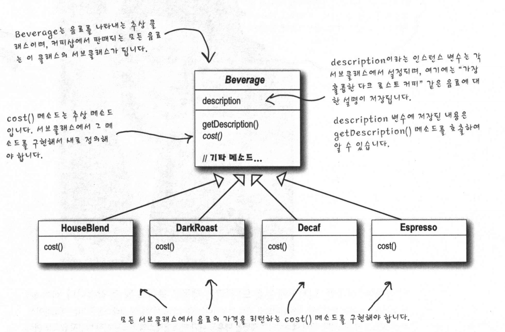
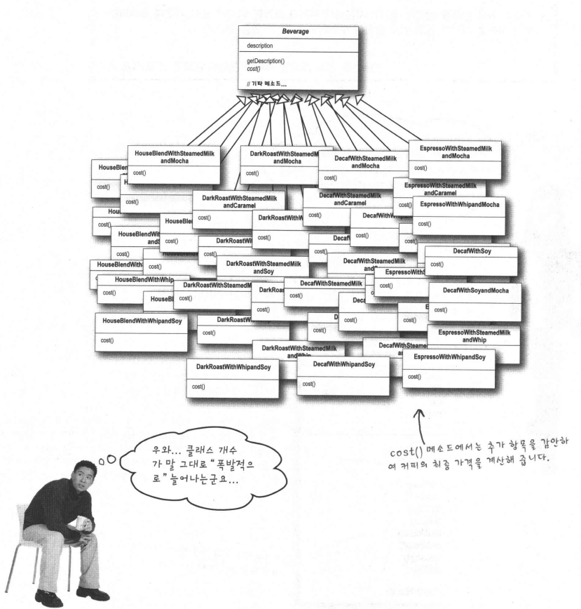
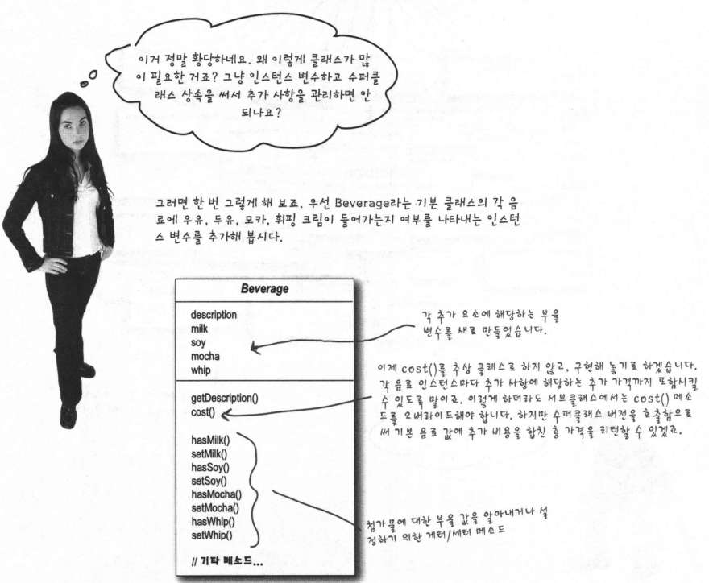
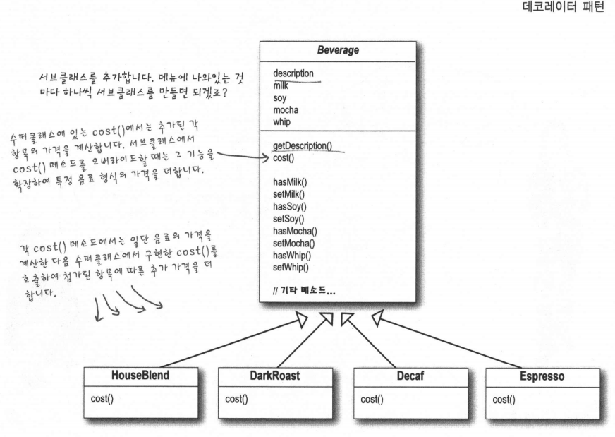
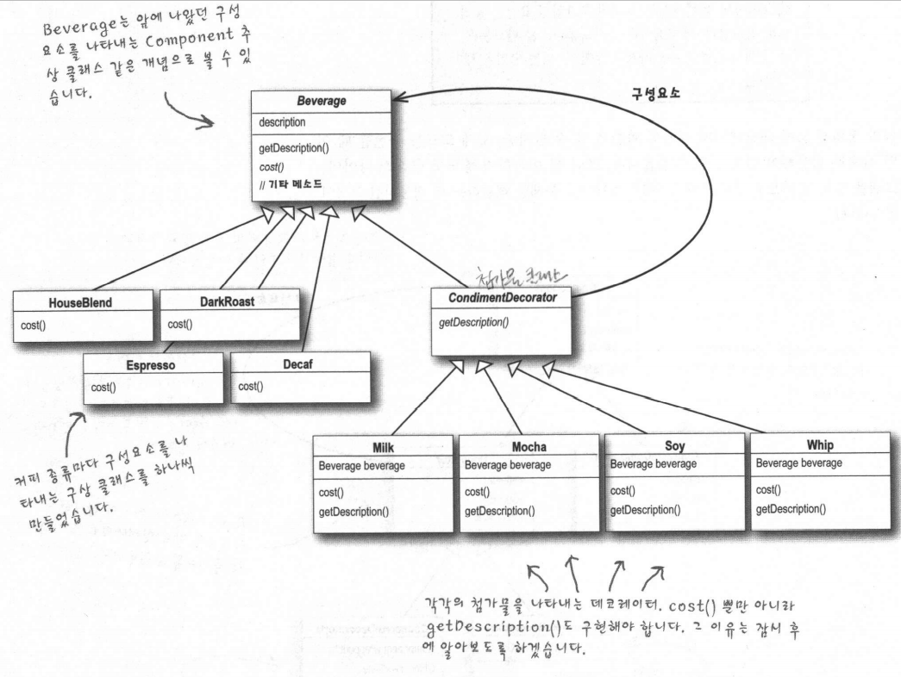

# 데코레이터패턴

## 스타버즈 이야기
스타버즈 커피는 급속도로 성장한 초대형 커피 전문점으로 유명합니다.
다양한 음료들을 모두 포괄하는 주문 시스템을 갖추려고 하는 중입니다.

커피를 주문할 때는 스팀 우유나 두유, 모카(초콜릿)를 추가하고, 그위에 휘핑크림을 얹기도 합니다. 각각을 추가할 때마다 커피 가격을 올리기 때문에, 주문 시스템에서도 그런 점들을 모두 고려해야합니다.

-------------------------------------------

## OCP (Open-Closed Principle)
클래스는 확장에 대해서는 열려 있어야한다 하지만 코드 변경에 대해서는 닫혀 있어야 한다.
기존 코드는 건드리지 않은 채로 확장을 통해서 새로운 행동을 간단하게 추가할 수 있도록 하는 게 바로 우리의 목표입니다. 이목표를 달성했을 떄 무엇을 얻을 수 있을까요? 새로운 기능을 추가하는데 있어서 매우 유연해서 급변하는 주변 환경에 잘 적응할 수 있으면서도 강하고 튼튼한 디자인을 만들 수 있겠죠.

## 데코레이터 패턴 
상속을 써서 음료 가격과 첨가물 가격을 합한 총 가격을 계산하는 방법은 그리 좋은 방법이 아닙니다. 클래스가 많이지거나 일부 서브클래스에는 적합하지 않은 기능을 베이스 클래스에 추가되는 문제가 있었죠

우선 특정 음료에서 시작해서, 첨가물로 그 음료를 장식 할 것 입니다. 예를 들어 어떤 손님이 모카하고 휘핑 크림을 추가한 다크 로스트 커피를 주문한다면 다음과 같은 식으로 할 수 있을 것입니다.
1. DarkRoast 객체를 가져온다
2. Mocha 객체로 장식한다.
3. Whip 객체로 장식한다
4. cost() 메소드를 호출한다. 이때 첨가물의 가격을 계산하는 일은 해당 객체들에게 위임된다.

그러면 객체를 어떻게 "장식" 할 수 있을까요? 그리고 이 과정에서 어떤 식으로 위임을 할 수 있는 걸까요? 

---

---
## 지금까지 배운 내용 정리
1. 데코레이터의 수퍼클래스는 자신이 장식하고 있는 객체의 수퍼클래스와 같다
2. 한 객체를 여러 개의 데코레이터로 감쌀 수 있다
3. 데코레이터는 자신이 감싸고 있는 객체와 같은 수퍼클래스를 가지고 있기 때문에 원래 객체가 들어갈 자리에 데코레이터 객체를 집어넣어도 상관 없습니다.
4. 데코레이터는 자신이 장식하고 있는 객체에게 어떤 행동을 위임하는 것 외에 원하는 추가적인 작업을 수행할 수 있다
5. 객체는 언제든지 감쌀 수 있기 때문에 실행중에 필요한 데코레이터를 마음대로 적용할 수 있다

## 데코레이터 패턴의 정의
데코레이터 패턴은 다음과 같은 식으로 정의됩니다.
데코레이터 패턴에서는 객체에 추가적인 요건을 동적으로 첨가한다. 데코레이터는 서브클래스를 만드는 것을 통해서 기능을 유연하게 확장할 수 있는 방법을 제공한다

위의 정의를 보면 데코레이터 패턴의 역할은 알 수 있지만, 실제 코드를 구현할 떄 어떤 식으로 적용해야 할지는 알기 힘들다. 

---

## 데코레이터가 적용된 예 : 자바 I/O
java.io 패키지에는 많은 클래스들이 있습니다. 자바I/O API를 보고 한숨을 쉬는 사람들이 여러분 말고도 수 없이 많이 있을 것입니다. 하지만 데코레이터 패턴을 배우고 나서 보면 그 많은 클래스들이 그리 무섭게 느껴지진 않을 겁니다. java.io 패키지의 많은 부분이 데코레이터 패턴을 바탕으로 만들어졌으니까요. 파일에서 데이터를 읽어오는 기능을 추가해주는 데코레이터를 사용하는 객체들 중에서 대표적인 것을 모아보면 다음과 같습니다.

---

출력 스트림의 디자인도 똑같습니다. Reader/Writer 스트림(문자 기반의 데이터를 처리하기 위한 스트림)도 스트림 클래스하고 거의 똑같이 디자인되어 있습니다.

자바 I/O를 보면 데코레이터의 단점도 발견할 수 있습니다. 데코레이터 패턴을 이용해서 디자인을 하다 보면 잡다한 클래스들이 너무 많아집니다. 그러다 보면 데코레이터를 기반으로 하는 API를 사용해야 하는 개발자 입장에서는 상당히 괴롭죠. 하지만 데코레이터가 어떤 식으로 작동하는지 이해하고 나면, 다른 사람이 데코레이터 패턴을 활용해서 만든 API를 쓰더라도 클래스들이 어떤 식으로 구성되어 있는지 일단 파악하고 나면 클래스를 데코레이터로 감싸서 원하는 행동을 구현할 수 있습니다.

## 핵심 정리
1. 상속을 통해 확장을 할 수도 있지만, 디자인의 유연성 면에서보면 별로 좋지 않다
2. 기존 코드를  수정하지 않고도 행동을 확장하는 방법이 필요하다
3. 구성과 위임을 통해서 실행중에 새로운 행동을 추가할 수 있다
4. 상속 대신 데코레이터 패턴을 통해서 행동을 확장할 수 있다
5. 대코레이터 패턴에서는 구상 구성요소를 감싸주는 데코레이터들을 사용한다
6. 데코레이터 클래스의 형식은 그 클래스가 감싸고 있는 클래스의 형식을 반영한다.(상속 또는 인터페이스 구현을 통해서 자신이 감쌀 클래스와 같은 형식을 가지게 된다)
7. 데코레이터에서는 자기가 감싸고 있는 구성요소의 메소드를 호출한 결과에 새로운 기능을 더함으로써 행동을 확장한다.
8. 구성요소를 감싸는 데코레이터의 개수에는 제한이 없다
9. 구성요소의 클라이언트 입장에서는 데코레이터의 존재를 알 수 없다. 쿨러아언트에서 구성 요소의 구체적인 형식에 의존하게 되는 경우는 예외
10. 데코레이터 패턴을 사용하면 자잘한 객체들이 매우 많이 추가될 수 있고, 데코레이터를 너무 많이 사용하면 코드가 필요 이상으로 복잡해질 수도 있다.